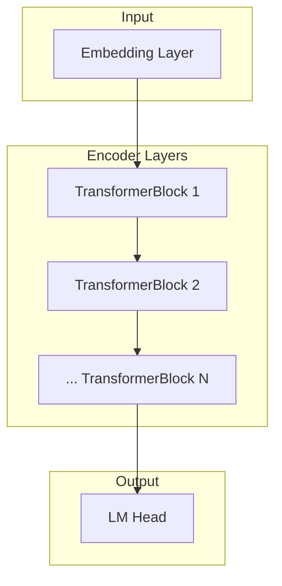
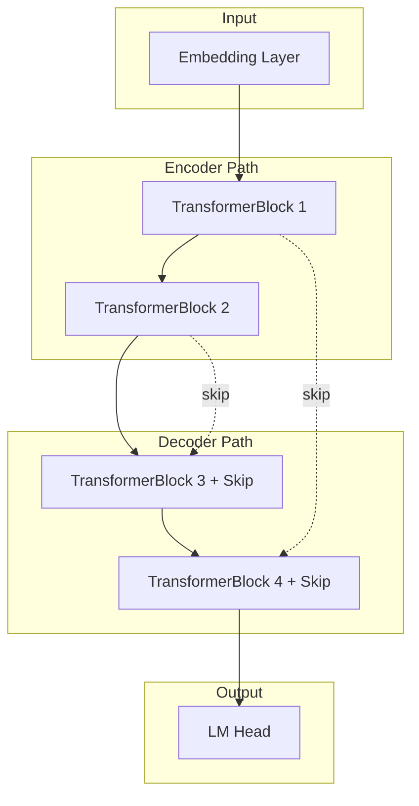
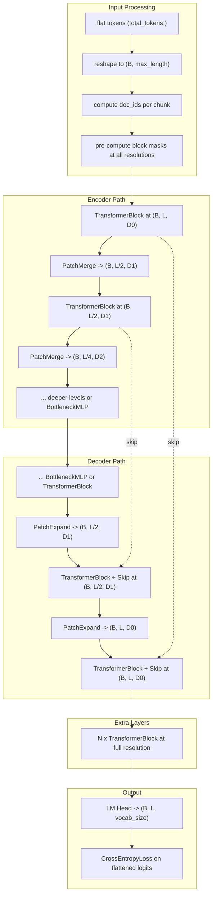

# Speedrunning Protein Language Model Training


Please reach out to Logan Hallee at `logan@synthyra.com` with any questions.
Open a GitHub issue with suggestions or a pull request to contribute.

## Overview

This project explores how to make protein language model (pLM) pretraining more
affordable through model architecture, optimization, data handling, and distributed
training. It grew out of [modded-nanogpt](https://github.com/KellerJordan/modded-nanogpt)
and now also adopts the fixed-benchmark experiment loop from
[Karpathy's autoresearch](https://github.com/karpathy/autoresearch).

The current speedrun objective is **15% MASK-only MLM on UniRef50**: independently
select 15% of eligible residues, replace every selected residue with `<mask>`, and
predict the original residue. Standard transformers, U-Nets, and patch U-Nets share
that objective. OMG_prot50 and OG_prot90 remain optional dataset tracks.

The project's original goal was to reduce reported pretraining costs from roughly
$10,000–1,000,000 to $10–100. Earlier runs reported ESM2/ESMC-comparable language
modeling losses with fewer parameters and lower costs. The background, diagrams,
measurements, and cost calculations behind that work are preserved below as
**historical results**, with their original evaluation conventions. They are not
measurements of the new fixed-15% workflow or guarantees of downstream quality.


## Table of contents

- [Current speedrun workflow](#current-speedrun-workflow)
- [Getting started: package, Docker, venv, and compiler setup](#getting-started)
- [Model architectures](#model-architectures)
- [Running experiments and current configuration](#running-experiments)
- [Metric and held-out evaluation](#metric-and-held-out-evaluation)
- [Workstation to GPU hosts](#workstation-to-gpu-hosts)
- [Autonomous agents](#autonomous-agents)
- [Reusable models and Hub publication](#reusable-models-and-hub-publication)
- [CPU tests](#cpu-tests)
- [Project background and research opportunities](#project-background-and-research-opportunities)
- [Performance benchmarks: historical throughput and costs](#performance-benchmarks)
- [ESM model evaluation: historical dataset results](#esm-model-evaluation)
- [Technical details: historical cost methodology](#technical-details)
- [Migration and legacy YAML workflow reference](#migration-and-legacy-yaml-workflow-reference)

## Current speedrun workflow

| File | Purpose |
| --- | --- |
| `prepare.py` | Prepare pinned data once; fixed tokenizer and evaluation protocol. |
| `train.py` | Run one bounded training experiment or evaluate a saved checkpoint. |
| `experiment.json` | Small, editable set of architecture and optimization settings. |
| `program.md` | Instructions for an autonomous coding agent on the workstation. |

`research.py` stages candidates on configured machines and retrieves results.
Implementation lives under `src/speedrunning_plms/research`. Reusable models remain
under `src/speedrunning_plms/models` and support Transformers `save_pretrained()`.

## Getting started

Clone the repository before following either setup path:

```bash
git clone https://github.com/Synthyra/SpeedrunningPLMs.git
cd SpeedrunningPLMs
```

### Install the package and prepare data

Use Python 3.10+ and a virtual environment. Install the PyTorch build appropriate
for the GPU hosts, then install this package:

```bash
python -m pip install -e ".[test,evaluation]"
python prepare.py --dataset uniref50 --output-dir data/uniref50 \
  --max-length 256 --train-sequences 100000 --eval-sequences 2048
```

Preparation streams the explicitly pinned source revision, writes local tensors,
and records their hashes and tokenizer/objective definitions in `manifest.json`.
Long sequences are divided into chunks with CLS/EOS; their tails are retained.
The limits count source sequences, so long sequences can produce multiple examples.
Downloads happen only during preparation. Training reads these local files.

Use `--dataset omg_prot50` or `--dataset og_prot90` for separate data tracks.
The tokenizer is the fixed ESM residue alphabet; no tokenizer download is needed.
Preparation fetches train and validation only unless `--include-test` is explicit.
Prepare a new directory to change data volume, sequence length, or dataset revision.
These choices change the benchmark identity and require a new baseline.

### Docker on Ubuntu or a Linux GPU host

The Dockerfile supplies CUDA 12.8, Python 3.12, PyTorch, and the package's test and
evaluation dependencies. The host needs Docker configured for NVIDIA GPUs. Build
the image, prepare data once, and run an experiment:

```bash
sudo docker build -t speedrun_plm .

sudo docker run --gpus all --shm-size=128g -v "${PWD}:/workspace" speedrun_plm \
  python prepare.py --dataset uniref50 --output-dir data/uniref50 \
  --max-length 256 --train-sequences 100000 --eval-sequences 2048

sudo docker run --gpus all --shm-size=128g -v "${PWD}:/workspace" speedrun_plm \
  python train.py --data-dir data/uniref50 --config experiment.json \
  --output-dir runs/baseline --time-budget 300 --device cuda
```

For multiple GPUs, replace the final `python train.py` invocation with
`torchrun --standalone --nproc_per_node=NUM_GPUS train.py` and keep the same training
arguments. Replace `NUM_GPUS` with the number of GPUs allocated to the experiment.
The bind mount keeps data, checkpoints, and results on the host.

### Python virtual environment

On a Linux GPU host, the setup script creates `.venv` by default and preserves an
existing environment:

```bash
chmod +x setup_plm.sh
./setup_plm.sh
source .venv/bin/activate
```

Set `VENV_DIR` for a different environment location or `PYTORCH_INDEX_URL` for a
different PyTorch build. The script prints the exact activation command. Use the
prepare/train commands above after activation; the former `~/plm_venv` path is no
longer the default. On Windows, create and activate a Python venv directly and use
the package installation commands.

### Compiler headers and HPC troubleshooting

If `torch.compile` fails because `Python.h` or a C/C++ compiler is missing, install development headers matching your Python interpreter. The original platform-specific setup guidance is retained below:

**Debian/Ubuntu:**

```bash
sudo apt-get update
sudo apt-get install -y python3.12-dev build-essential
```

If python3.12-dev is not found: `sudo apt-get install -y python3-dev build-essential`

**Fedora/RHEL:**
```bash
sudo dnf groupinstall -y "Development Tools"
sudo dnf install -y python3-devel
```

**openSUSE:**
```bash
sudo zypper install -y python3-devel gcc gcc-c++ make
```

**Arch:**
```bash
sudo pacman -S --needed base-devel python
```

## Model architectures

Select these with `--architecture standard`, `unet`, or `patch_unet`.

We provide three model architecture options, ranging from standard baselines to highly optimized experimental designs.

### 1. Regular Transformer
The standard encoder-only architecture (like BERT/ESM) where the sequence length and hidden dimension remain constant throughout all layers. This serves as a strong baseline.



### 2. Transformer UNet
A U-Net architecture that uses skip connections between encoder and decoder layers, but maintains the same sequence length and hidden dimension throughout (no downsampling). This allows the model to mix features from early and late layers.



### 3. Patch UNet Transformer
A U-Net variant designed for speed. It uses "Patch Merging" (concatenating adjacent tokens) for downsampling, followed by expansion and skip connections. The model accepts batched inputs `(b, l)` and handles document boundaries and padding. The diagram shows the packed-token input path retained in the model library; the current research engine supplies prepared batches directly.



## Running experiments

```bash
python train.py --data-dir data/uniref50 --config experiment.json \
  --output-dir runs/baseline --time-budget 300 --device cuda
```

For several GPUs on one machine:

```bash
torchrun --standalone --nproc_per_node=4 train.py \
  --data-dir data/uniref50 --config experiment.json \
  --output-dir runs/baseline-4gpu --time-budget 300 --device cuda
```

The training budget includes training steps and their compilation overhead. Data
loading, model construction, final evaluation, and checkpoint writing are reported
in total wall time separately. Rank zero checks the deadline between microbatches
and before each optimizer update; unfinished accumulation is discarded. An in-flight
operation can finish after the deadline, so actual training time is recorded and
runs exceeding the budget by more than 5% are excluded from comparisons. Distributed
ranks stop together, and losses are weighted by masked-residue count, not batch count.

Each successful training run writes `result.json` and a loadable `checkpoint/` in a new output
directory. Results include the benchmark identity, model/configuration, seed,
hardware, world size, timing, and metric. Existing results are not overwritten.
There is no automatic model publication or experiment-tracking login.

For a short CPU smoke run:

```bash
python train.py --data-dir data/uniref50 --output-dir runs/smoke \
  --device cpu --hidden-size 8 --heads 2 --layers 2 --batch-size 2 --max-steps 2
```

Step-limited runs are for debugging and do not qualify for fixed-budget comparisons.
Explicit CLI values override JSON configuration; unknown fields are rejected.
Use `--architecture unet` or `--architecture patch_unet` to change architecture.
Use `--compile` and `--bf16` only on hardware that supports them.

### Current configuration reference

Edit `experiment.json` or pass the corresponding hyphenated CLI flags. For example,
the JSON field `hidden_size` corresponds to `--hidden-size`. `--config` selects a
JSON file; explicit CLI flags override it. These defaults come from
`src/speedrunning_plms/research/engine.py`.

| Argument | Default | Meaning |
| --- | --- | --- |
| `--data-dir` | `data/uniref50` | Prepared dataset directory containing its manifest. |
| `--output-dir` | `runs/baseline` | New result/checkpoint directory. |
| `--time-budget` | `300` | Training time budget in seconds. |
| `--max-steps` | unset | Optional debug limit; excludes the run from budget comparisons. |
| `--device` | `auto` | `auto`, `cpu`, or `cuda`. |
| `--seed` | `42` | Training seed, fixed within a comparison. |
| `--batch-size` | `16` | Sequences per microbatch per rank, not the old token-batch unit. |
| `--grad-accum` | `1` | Microbatches per optimizer update. |
| `--learning-rate` | `0.0003` | AdamW learning rate. |
| `--weight-decay` | `0.01` | AdamW weight decay. |
| `--architecture` | `standard` | `standard`, `unet`, or `patch_unet`. |
| `--hidden-size` | `256` | Model hidden width. |
| `--heads` | `4` | Attention heads. |
| `--layers` | `6` | Transformer layers; even for `unet`. |
| `--patch-layers` | `4` | Patch U-Net layers; must be even. |
| `--compile` / `--no-compile` | off | Compile the training model. |
| `--bf16` / `--no-bf16` | off | Use bfloat16 training autocast; evaluation remains float32. |
| `--cpu-threads` | `1` | CPU threads used by the experiment. |
| `--evaluate-only` | unset | Load a local checkpoint for explicit evaluation. |
| `--split` | `valid` | `valid`, or `test` with `--evaluate-only`. |

Sequence length and dataset identity are set during preparation, not by training
flags. The masking probability and replacement rule are fixed by the benchmark.
Run `python train.py --help`, `python prepare.py --help`, or
`python research.py run --help` for entry-point options.

### Experiment records and launcher wrapper

Each run through `research.py` records its source, configuration, result, logs, and comparison key.
The current launcher wrapper forwards one explicit experiment to `research.py`:

```bash
chmod +x run_experiments.sh
./run_experiments.sh --target targets.local.json --name baseline \
  --data-dir /absolute/path/to/data/uniref50 --config experiment.json \
  --time-budget 300
```

Historical experiment documentation remains available in the
[experiment hub](https://gleghorn-lab.github.io/SpeedrunningPLMs/) and
[stored experiment records](misc/experiments.tsv). Its scores use the historical
protocol described below. The old automatic YAML sweep is retained as a reference
in the [migration section](#migration-and-legacy-yaml-workflow-reference).

## Metric and held-out evaluation

The primary score is **validation bits per masked residue**, lower is better:

```text
sum(cross_entropy over selected residues) / (number of selected residues * ln(2))
```

This is a conditional MLM score, not autoregressive bits per byte. Cross-entropy in
nats and masked accuracy are also reported. Evaluation masks are deterministic per
example and do not change with batch size or GPU partitioning. CLS, EOS, padding,
unknown/null/mask tokens, and alignment gaps are never selected. Residues use
independent Bernoulli(0.15) selection; no extra residue is forced into short sequences.
All ranks contribute sums and counts once, without duplicated evaluation examples.
Evaluation always uses float32, independent of the candidate's training precision.

Use validation for search. Compare the same benchmark, seed, time budget, and hardware
allocation. Confirm small gains across multiple seeds rather than choosing a lucky
seed. Never feed test results back into the search loop.

After selecting a model, explicitly prepare a separate dataset directory with
`--include-test` and evaluate its checkpoint:

```bash
python train.py --evaluate-only runs/baseline/checkpoint --split test \
  --data-dir data/uniref50-final --output-dir runs/final-test --device cuda
```

Use the same dataset revision, tokenizer, and sequence length as the selection
benchmark. Final evaluation cannot be requested as part of a training run.

## Workstation to GPU hosts

Copy an example from `targets/` to `targets.local.json` and set the actual SSH
aliases, absolute staging paths, Python executables, and GPUs per node. The local
target uses `host: null`; Windows local paths may use `C:/...`. Remote hosts use
Linux/POSIX paths and require Python, PyTorch/package dependencies, SSH, and
GNU `timeout` and `setsid`. Provision dependencies and prepared data before starting a session.
The runner does not provision machines or download data.

```bash
python research.py run --target targets.local.json --name baseline \
  --data-dir /absolute/path/to/data/uniref50 --config experiment.json \
  --time-budget 300 --dry-run

python research.py run --target targets.local.json --name baseline \
  --data-dir /absolute/path/to/data/uniref50 --config experiment.json \
  --time-budget 300
```

The first command shows the plan without connecting or launching compute. The second
snapshots the candidate source, stages it in a unique directory, starts the run,
and retrieves results and logs to the workstation. Checkpoints stay at the recorded
execution location. Credentials, `.git`, caches, and datasets are excluded from the
source archive. Existing remote checkouts are not reset or modified.
Cancellation first lets `torchrun` stop its workers, then forces termination if
needed. Remote timeouts include a 45-second grace period before forced termination.

For multiple nodes, use the cluster target example. Nodes need equal GPU counts,
the same prepared data at the same absolute path, and a reachable rank-zero address
and rendezvous port. Use an existing allocation if the cluster has a scheduler.
Each node runs `torchrun`; this is not a Slurm provisioning layer. One workstation
process owns an experiment and its local results ledger. Run separate sessions in
separate output directories and allocate disjoint devices when searching in parallel.

## Autonomous agents

Give the agent `program.md`, a target, a prepared-data path, a session name, a per-run
budget, and a maximum experiment count. It edits candidates, invokes the runner,
reads returned results, and keeps or discards its own changes. The runner records
source hashes and comparison keys; the agent records hypotheses and decisions.
Comparison keys distinguish data, evaluator, hardware, framework versions, seed,
and training budget. The launcher verifies the reported evaluator against its
staged source before accepting a score.
The evaluation protocol stays fixed. No separate inference API integration is needed.

Examples using already authenticated coding clients:

```bash
codex exec --sandbox workspace-write -m gpt-6-astra \
  "Follow program.md. Target targets.local.json; data /data/uniref50; session astra-01; 300 seconds per run; at most 20 experiments."

codex exec --sandbox workspace-write -m gpt-5.6-sol \
  "Follow program.md. Target targets.local.json; data /data/uniref50; session sol-01; 300 seconds per run; at most 20 experiments."

claude -p --model claude-opus-5-5 \
  "Follow program.md. Target targets.local.json; data /data/uniref50; session opus-01; 300 seconds per run; at most 20 experiments."
```

Configure the client to permit the project runner and the specified SSH targets
before unattended use. These commands preserve the client's permission controls.
The maximum experiment count is an agent instruction; the launcher enforces each
job's timeout. Model availability depends on the client/account. See the official
[Codex CLI guidance](https://learn.chatgpt.com/docs/non-interactive-mode),
[Codex models](https://learn.chatgpt.com/docs/models), and
[Claude model configuration](https://code.claude.com/docs/en/model-config).

## Reusable models and Hub publication

Install the reusable model, data, optimizer, and training modules from the
repository root:

```bash
python -m pip install .
```

Optional dependencies retained for historical training integrations are available with:

```bash
python -m pip install ".[training]"
```

Install benchmark dependencies with `python -m pip install ".[evaluation]"`.

Models saved with `save_pretrained()` include the custom model code and
canonical Transformers `AutoClass` metadata. A local checkpoint can be loaded
directly with `PLM.from_pretrained(path)`. A model repository can be loaded as
custom code after inspecting its source and pinning an immutable revision:

```python
from transformers import AutoModelForMaskedLM

model = AutoModelForMaskedLM.from_pretrained(
    "organization/model-name",
    trust_remote_code=True,
    revision="full-hub-commit-sha",
    code_revision="full-hub-commit-sha",
)
```

The model follows the standard masked-language-model interface. Batched
`input_ids`, `attention_mask`, and optional `labels` return a
`MaskedLMOutput` with `loss` and `logits`.

The current research engine does not require the `training` extra or a tracking login.

### Explicit publication

The former training CLI could upload a model after training. The current research
runner saves checkpoints locally. Publication is a separate, explicit library call:

```python
from speedrunning_plms import PLM
from speedrunning_plms.training.publishing import publish_model_to_hub

model = PLM.from_pretrained("runs/baseline/checkpoint", local_files_only=True)
publish_model_to_hub(model, "organization/model-name", enabled=True)
```

Use existing Hugging Face authentication for that operation. The helper validates
and uploads one complete artifact containing weights (including supported sharded
checkpoints), configuration, custom code, and runtime requirements. It does not
upload a code-only artifact at startup. `enabled=False` is the default.

## CPU tests

```bash
python -m pip install torch==2.6.0 --index-url https://download.pytorch.org/whl/cpu
python -m pip install -e ".[test,evaluation]"
python -m pytest -q
```

The tests use tiny synthetic data, run offline, disable CUDA, and limit CPU threads.
They check corruption and metric semantics, architecture gradients and masking,
sharded serialization/publication, local training, distributed behavior, transport
command construction, data integrity, and built-package installation. SSH command
tests do not establish performance or connectivity on your GPU hosts.
The CPU CI workflow runs this suite on Python 3.10 and 3.12.
Run the historical viewer's offline checks with `node --test tests/test_hub.cjs`.
See [code review coverage](docs/code-review.md) for the repository standards pass
and its verification limits.

## Project background and research opportunities

The following introduction and research notes preserve the motivation behind the
original speedrunning project. Dollar figures, model comparisons, and NanoGPT
timings here describe that earlier work, not current provider prices or a new
benchmark run. The historical overview described matching ESMC-300M and larger
ESMC models; the detailed result tables below identify the evaluated ESMC-600M model.

### Introduction

Protein Language Models (pLMs) are representation learning algorithms which, primarily, map discrete amino acids to a continuous latent space. By training pLMs through semi-supervised denoising, like Masked Language Modeling (MLM), pLMs become adept at filling in hidden amino acids to make plausible sequences. After many types of training, the internal representations of pLMs correlate highly with valuable protein properties - the type of catalytic characteristics or biological associations that wet-lab experiments can take years and millions of dollars to verify. With the immense value of accelerated protein annotation and design backing pLM projects, they have become cornerstones of various life science communities.

However, training pLMs, specifically the large-scale semi-supervised pretraining, has been historically quite expensive - the type of cost only large tech companies, or sponsorships through large tech companies, can afford. Luckily, the Natural Language Processing (NLP) community has seen astronomical talent and money investments since the rise in popularity of AI chat bots. Additionally, the data repositories of protein sequences continue to dramatically grow due to the decreasing costs associated with genome sequencing combined with improvements to genome annotation. The pLM community gets to plug into both of these rapidly advancing spaces to continually enhance the types of analysis and affordability behind our models.

The large cost associated with pLM pretraining was notably questioned in the [AMPLIFY](https://www.biorxiv.org/content/10.1101/2024.09.23.614603v1.full) paper, where popular pLMs were reproduced at a fraction of the cost due to modern NLP techniques. In tandem, they argued that pLMs should be retrained often due to the frequent quality and size upgrades to sequence repositories. Then, we noticed the [NanoGPT speedrun](https://github.com/KellerJordan/modded-nanogpt). The contributors to NanoGPT were speeding up (the already ridiculously fast) llm.c GPT2 speedrun, now down to less than 3 minutes from a 45 minute starting point. The cost of reproducing a leading 2019 language model? ~**$1.13**. Now that is the type of cost that is truly democratizing!

And so, this repository is our attempt to take PLM training to the next level. We have gathered the non-trivial improvements to the vanilla transformer architecture, typical optimizers, dataloading and distributed training, as well as high quality modern meta-genomic datasets to speedrun pLM pretraining between ~$10-100. The preliminary results are promising, with several runs in the $10-100 range matching the validation loss of ESM2-650 and ESMC-300 models, often using a fraction of the parameters as well. So the project is done, right? Not quite.

### Research opportunities

These are retained research directions. Weight tying, intermediate representations,
and encoder/decoder designs remain architectural questions; masked diffusion and
variable-rate objectives described here are outside the current fixed-15% track.

One training technique that enhances pLM representation quality, improving correlation between hidden states and valuable properties, is weight tying between token embeddings and the language modeling head. Multiple studies ([1](https://arxiv.org/abs/2111.09543), [2](https://arxiv.org/abs/2412.13663), [3](https://arxiv.org/pdf/2506.08293)) have demonstrated that tied language modeling heads improve representation quality. However, this approach significantly slows convergence of the language modeling loss, resulting in slower and more expensive training.

Recent work suggests this may no longer be a significant limitation. Several studies have shown that the final hidden state of transformer models rarely produces the highest quality embeddings ([1](https://arxiv.org/pdf/2502.02013), [2](https://www.biorxiv.org/content/10.1101/2024.02.05.578959v2)). This makes intuitive sense - significant expansion and compression of hidden states occur at the model's beginning and end, respectively. If we no longer prioritize final hidden state quality (since it's rarely optimal), we may be able to optimize internal representations while avoiding weight tying, maintaining both speed and quality. This approach shows particular promise with the innovative UNet transformer architecture inspired by NanoGPT.


Additional research directions include direct encoder-decoder architectures to stratify representation learning and generative capabilities, autoencoders, and clever regularization at intermediate transformer layers.

Another limitation of traditional pLM training lies in MLM itself, which results in poor generation capabilities and hampers protein design prospects. Recent work from our group introduced [DSM](https://github.com/Gleghorn-Lab/DSM), which reformats pLM MLM into masked diffusion, enhancing generative qualities. However, naive replacement of MLM with masked diffusion in speedrun contexts doesn't work perfectly. A warmup strategy from fixed-rate MLM to variable-rate masked diffusion may provide optimal results for both objectives.

## Performance benchmarks

These measurements and cost estimates are preserved from the previous README.
They describe the earlier trainer, batch units, model, and evaluation protocol.
Vendor rates are historical, including the June 2025 pricing used in the cost
analysis. They are not current quotes or measured performance of the new engine.

`evaluation/benchmark_esm.py` loads every model, remote-code module,
tokenizer, and dataset from the full commit SHA recorded in
`evaluation/benchmark_manifest.json`. Update that manifest intentionally when
changing benchmark inputs so result provenance remains reproducible.

### Historical batch sizing

Batch sizes of 8×64×1024 (524,288) or 4×64×1024 (262,144) tokens have demonstrated excellent performance. We recommend a local batch size of 64×1024 (65,536) tokens for 80GB VRAM systems, with adjustments for smaller configurations.

**Example**: For a desired batch size of 524,288 tokens on 4×A100 80GB GPUs, use gradient accumulation (`--grad_accum`) of 2:
```
524,288 ÷ 4 ÷ 2 = 65,536 tokens per GPU
```

### Historical system performance

Our optimized trainer and dataloader incorporate prefetching and multiple workers per GPU to accelerate data handling, with masking performed at the data loading stage. This results in improved throughput, particularly beneficial for systems with slower disk I/O.

**Training Throughput**

(Default model: 133M parameters, 24 blocks, UNet + Value embeddings, 768 hidden size):

| Hardware | Vendor | Cost/Hour | Tokens/Second |
|----------|--------|-----------|---------------|
| 1 × H100 80GB SXM5, 26 vCPUs | Lambda Labs | $3.29 | 275,900 |
| 1 x H200 142GB NVLink, 16 vCPUs | Nebius | $3.64 | 327,680 |
| 4 × A100 80GB PCIe Gen4, 96 vCPUs | Azure | $18.36 | 340,700 |
| 1 × GH200 96GB ARM64, 64 vCPUs | Lambda Labs | $1.49 | 1,011,800 |
| 8 × H100 80GB SXM5, 208 vCPUs | Lambda Labs | $23.92 | 2,149,500 |

### Cost Analysis

Based on the historical performance metrics above, training ESM2-150M equivalent with the old optimizer / architecture (2M token batch size, 500K steps) would require approximately 129 hours at $3,091 using 8×H100 systems (Lambda pricing as of June 2025). This represents a reduction over the estimated $46,000 cost for ESM2-150M training via AWS in 2022. Obviously with better architecture, data, and optimizers, etc. (our improvements) this is dramatically decreased even further.

Memory and disk I/O remain primary bottlenecks on some systems, as evidenced by the GH200's superior performance. Further optimizations to data loading and prefetching may yield additional improvements.

## ESM model evaluation

The six tables below retain the original values, dataset links, sequence counts,
and token counts. The legacy evaluator uses its historical masking convention and
batch-averaged loss; these losses and perplexities are not directly comparable to
the new residue-weighted fixed-15% score. Low loss alone does not establish data
leakage or downstream biological quality. The following leakage discussion and
target loss are historical interpretation, not a cutoff for the current protocol.

Models achieving validation losses below 2.0 on certain splits may indicate training on similar sequences (or direct training, especially in the case of ESMC on the metagenomic data). A validation loss target of approximately 2.1 without data leakage appears highly competitive.

### OMG Prot50 Dataset

- **Source**: [tattabio/OMG_prot50](https://huggingface.co/datasets/tattabio/OMG_prot50)
- **Split Version**: [Synthyra/omg_prot50](https://huggingface.co/datasets/Synthyra/omg_prot50)
- **Evaluation**: 10,000 sequences, 2,500 batches

#### Validation Split Results (303,545 tokens)

| Model | Loss | Perplexity | Accuracy | Precision | Recall | F1 | MCC |
|-------|------|-----------|----------|-----------|--------|----|----|
| ESM2-8M | 2.618 | 13.706 | 0.212 | 0.248 | 0.212 | 0.198 | 0.152 |
| ESM2-35M | 2.500 | 12.186 | 0.261 | 0.296 | 0.261 | 0.251 | 0.207 |
| ESM2-150M | 2.390 | 10.915 | 0.305 | 0.336 | 0.305 | 0.298 | 0.255 |
| ESMC-300M | 2.192 | 8.954 | 0.368 | 0.397 | 0.368 | 0.364 | 0.324 |
| ESMC-600M | 2.154 | 8.623 | 0.381 | 0.408 | 0.381 | 0.378 | 0.338 |
| ESM2-650M | 2.267 | 9.652 | 0.352 | 0.382 | 0.352 | 0.348 | 0.307 |
| ESM2-3B | 2.200 | 9.024 | 0.378 | 0.403 | 0.378 | 0.375 | 0.335 |

#### Test Split Results (307,141 tokens)

| Model | Loss | Perplexity | Accuracy | Precision | Recall | F1 | MCC |
|-------|------|-----------|----------|-----------|--------|----|----|
| ESM2-8M | 2.620 | 13.737 | 0.210 | 0.247 | 0.210 | 0.196 | 0.150 |
| ESM2-35M | 2.505 | 12.242 | 0.259 | 0.296 | 0.259 | 0.250 | 0.206 |
| ESM2-150M | 2.391 | 10.930 | 0.305 | 0.337 | 0.305 | 0.299 | 0.256 |
| ESMC-300M | 2.191 | 8.942 | 0.369 | 0.398 | 0.369 | 0.365 | 0.325 |
| ESMC-600M | 2.154 | 8.619 | 0.384 | 0.409 | 0.384 | 0.380 | 0.341 |
| ESM2-650M | 2.268 | 9.655 | 0.353 | 0.382 | 0.353 | 0.349 | 0.308 |
| ESM2-3B | 2.203 | 9.051 | 0.377 | 0.402 | 0.377 | 0.374 | 0.334 |

### OG Prot90 Dataset

- **Source**: [tattabio/OG_prot90](https://huggingface.co/datasets/tattabio/OG_prot90)
- **Split Version**: [Synthyra/og_prot90](https://huggingface.co/datasets/Synthyra/og_prot90)
- **Evaluation**: 10,000 sequences, 2,500 batches

#### Validation Split Results (442,548 tokens)

| Model | Loss | Perplexity | Accuracy | Precision | Recall | F1 | MCC |
|-------|------|-----------|----------|-----------|--------|----|----|
| ESM2-8M | 2.476 | 11.890 | 0.236 | 0.266 | 0.236 | 0.220 | 0.176 |
| ESM2-35M | 2.248 | 9.465 | 0.314 | 0.339 | 0.314 | 0.303 | 0.262 |
| ESM2-150M | 2.037 | 7.664 | 0.383 | 0.400 | 0.383 | 0.376 | 0.338 |
| ESMC-300M | 1.697 | 5.460 | 0.485 | 0.497 | 0.485 | 0.481 | 0.449 |
| ESMC-600M | 1.628 | 5.094 | 0.507 | 0.517 | 0.507 | 0.503 | 0.472 |
| ESM2-650M | 1.800 | 6.051 | 0.460 | 0.472 | 0.460 | 0.455 | 0.422 |
| ESM2-3B | 1.662 | 5.271 | 0.505 | 0.513 | 0.505 | 0.501 | 0.470 |

#### Test Split Results (449,207 tokens)

| Model | Loss | Perplexity | Accuracy | Precision | Recall | F1 | MCC |
|-------|------|-----------|----------|-----------|--------|----|----|
| ESM2-8M | 2.470 | 11.817 | 0.238 | 0.268 | 0.238 | 0.223 | 0.178 |
| ESM2-35M | 2.240 | 9.396 | 0.316 | 0.342 | 0.316 | 0.306 | 0.265 |
| ESM2-150M | 2.023 | 7.564 | 0.387 | 0.404 | 0.387 | 0.380 | 0.342 |
| ESMC-300M | 1.687 | 5.402 | 0.487 | 0.500 | 0.487 | 0.483 | 0.451 |
| ESMC-600M | 1.616 | 5.031 | 0.508 | 0.519 | 0.508 | 0.505 | 0.474 |
| ESM2-650M | 1.787 | 5.969 | 0.465 | 0.477 | 0.465 | 0.460 | 0.427 |
| ESM2-3B | 1.651 | 5.212 | 0.508 | 0.515 | 0.508 | 0.504 | 0.473 |

### UniRef50 Dataset

- **Source**: [agemagician/uniref50_09012025](https://huggingface.co/datasets/agemagician/uniref50_09012025)
- **Split Version**: [Synthyra/uniref50](https://huggingface.co/datasets/Synthyra/uniref50)
- **Evaluation**: 10,000 sequences, 2,500 batches

#### Validation Split Results (405,314 tokens)

| Model | Loss | Perplexity | Accuracy | Precision | Recall | F1 | MCC |
|-------|------|-----------|----------|-----------|--------|----|----|
| ESM2-8M | 2.575 | 13.134 | 0.213 | 0.255 | 0.213 | 0.201 | 0.155 |
| ESM2-35M | 2.453 | 11.623 | 0.258 | 0.297 | 0.258 | 0.250 | 0.204 |
| ESM2-150M | 2.324 | 10.212 | 0.303 | 0.337 | 0.303 | 0.298 | 0.254 |
| ESMC-300M | 2.161 | 8.679 | 0.347 | 0.379 | 0.347 | 0.344 | 0.302 |
| ESMC-600M | 2.109 | 8.244 | 0.364 | 0.393 | 0.364 | 0.362 | 0.320 |
| ESM2-650M | 2.165 | 8.717 | 0.357 | 0.387 | 0.357 | 0.355 | 0.313 |
| ESM2-3B | 2.053 | 7.788 | 0.395 | 0.419 | 0.395 | 0.393 | 0.354 |

#### Test Split Results (400,117 tokens)

| Model | Loss | Perplexity | Accuracy | Precision | Recall | F1 | MCC |
|-------|------|-----------|----------|-----------|--------|----|----|
| ESM2-8M | 2.577 | 13.156 | 0.213 | 0.254 | 0.213 | 0.202 | 0.155 |
| ESM2-35M | 2.455 | 11.648 | 0.257 | 0.296 | 0.257 | 0.250 | 0.204 |
| ESM2-150M | 2.328 | 10.261 | 0.302 | 0.335 | 0.302 | 0.297 | 0.253 |
| ESMC-300M | 2.159 | 8.659 | 0.348 | 0.379 | 0.348 | 0.345 | 0.303 |
| ESMC-600M | 2.111 | 8.256 | 0.364 | 0.393 | 0.364 | 0.362 | 0.320 |
| ESM2-650M | 2.165 | 8.717 | 0.357 | 0.385 | 0.357 | 0.354 | 0.313 |
| ESM2-3B | 2.059 | 7.835 | 0.393 | 0.416 | 0.393 | 0.391 | 0.352 |

## Technical details

These are the original cost-estimation assumptions, not current pricing or new measurements.

<details>
<summary><strong>Pretraining Cost Calculation Methodology</strong></summary>

### ESM-1B
- **Training**: 4.25 hours per epoch × 56 epochs on 128 V100 GPUs
- **Source**: [Notable AI Models Database](https://epoch.ai/data/notable-ai-models)
- **Calculation**: 238 hours × 128 GPUs = 30,464 V100 hours
- **Cost Estimate**: Based on AWS 8×V100 (~$24.48 on-demand), adjusted for 2020 pricing and scale, estimated at $1.53/GPU-hour
- **Total**: $1.53 × 30,464 = $46,610

### Other Models
- **ProtBERT, ProtT5, Progen2**: Estimates from [Notable AI Models Database](https://epoch.ai/data/notable-ai-models)
- **ESM2-15B**: Approximately $1.5M USD ([AMPLIFY paper](https://www.biorxiv.org/content/10.1101/2024.09.23.614603v1.full))
- **ESM2-3B**: ~50% of ESM2-15B FLOPs ([ESM Discussion](https://github.com/facebookresearch/esm/discussions/414))
- **ESM2-650M**: ~25% of ESM2-3B FLOPs
- **ESM2-150M**: ~25% of ESM2-650M FLOPs
- **ESM2-35M**: ~25% of ESM2-150M FLOPs
- **ESM2-8M**: ~25% of ESM2-35M FLOPs

### ESM3-98B
- **FLOPs**: 1.07×10²⁴ ([ESM3 paper](https://www.science.org/doi/10.1126/science.ads0018))
- **Efficiency**: Assumed similar to Llama 3.1-405B (1.34×10⁻¹⁸ $/FLOP)
- **Estimated Cost**: ~$1.4M

</details>

## Migration and legacy YAML workflow reference

`--yaml_path`, diffusion, masking schedules, interactive token prompts, and the large
legacy trainer have been retired from the training entry point. Use experiment.json
and the fixed benchmark instead. Packed-data tools and the ESM baseline evaluator
are retained for historical comparisons; they are not the new
search protocol. Historical scores should not be compared directly with this one.
The historical ESM evaluator retains its forced minimum mask and batch-averaged
score for compatibility; the research evaluator uses residue-weighted scoring.
Library checkpoint loading and explicit `publish_model_to_hub()` remain available.

### Legacy YAML workflow

The following configuration, execution behavior, and CLI defaults document the
retired trainer. They are preserved to interpret existing experiment records and
reproduce runs from the
[pre-refactor revision](https://github.com/Synthyra/SpeedrunningPLMs/tree/fb724996d998e82bf6a837b3ad5ec2ef3c1dbabb).
They **do not run against the current training entry point**. Old YAML examples
remain available at that revision's
[example_yamls directory](https://github.com/Synthyra/SpeedrunningPLMs/tree/fb724996d998e82bf6a837b3ad5ec2ef3c1dbabb/example_yamls).

<details>
<summary><strong>Historical configuration and Docker execution</strong></summary>

Configure experiments by editing the example YAML files with your desired settings (`example_yamls/default.yaml`). Create a YAML file for each experiment and place them in the `experiments` folder on your training system. Make sure you build the docker image first.

### Historical execution behavior

```bash
chmod +x run_experiments.sh
./run_experiments.sh
```

This script will automatically:
- Determine the number of GPUs on your system
- Prompt for HuggingFace and Weights & Biases tokens
- Launch the docker image for each experiment
- Execute all YAML files in the `experiments` directory sequentially

The old single-job Docker invocation was:

```bash
sudo docker run --gpus all --shm-size=128g -v "${PWD}:/workspace" speedrun_plm \
  torchrun --standalone --nproc_per_node=NUM_GPUS train.py \
  --yaml_path experiments/my_experiment.yaml
```

The old setup script used `source ~/plm_venv/bin/activate`. Current setup uses
`.venv` unless `VENV_DIR` overrides it. The old trainer's `--push_to_hub`,
`--hf_model_name`, `--hf_token`, and `--wandb_token` options belonged to its explicit
publication/tracking integrations; use the separate publication helper above for
the current workflow.

</details>

### Retired command-line arguments

<details>
<summary><strong>Full retired CLI reference and original defaults</strong></summary>

| Argument | Type | Default | Description |
|----------|------|---------|-------------|
| `--yaml_path` | str | None | Path to YAML file with experiment configuration. CLI arguments override YAML. |
| `--hf_token` | str | None | Hugging Face token for an explicitly enabled publication. |
| `--wandb_token` | str | None | Weights & Biases API token (for experiment tracking). Prompted if not provided. |
| `--log_name` | str | None | Name for the log file and wandb run. If not set, a random UUID is used. |
| `--bugfix` | flag | False | Use small batch size and max length for debugging. |
| `--save_path` | str | "Synthyra/speedrun_test" | Path to save the model and report to wandb. |
| `--data_name` | str | "uniref50" | Dataset name: uniref50, omg_prot50, or og_prot90 |
| `--num_chunks` | int | 100 | Number of training chunks to ensure are downloaded. |
| `--seed` | int | 42 | Random seed for reproducibility. |
| `--clear_cache_every` | int | 1000 | Clear CUDA cache every N steps. |
| `--grad_clip` | float | 0.0 | Gradient clipping value (0 to disable). |
| `--auto_grad_clip` | flag | False | Enable auto gradient clipping. |
| `--auto_grad_clip_p` | float | 10.0 | Percentile for auto gradient clipping. |
| `--hidden_size` | int | 768 | Hidden size of the model. |
| `--num_attention_heads` | int | 6 | Number of attention heads. |
| `--num_hidden_layers` | int | 24 | Number of hidden layers. |
| `--vocab_size` | int | 33 | Vocabulary size. |
| `--expansion_ratio` | float | 2.6667 | Expansion ratio for MLP (8/3). |
| `--soft_logit_cap` | float | 32.0 | Soft logit cap for output logits. |
| `--tie_embeddings` | flag | False | Tie input and output embeddings. |
| `--unet` | bool | True | Use UNet architecture. |
| `--token_dropout` | bool | True | Use token dropout. |
| `--bfloat16` | flag | False | Use bfloat16 precision. |
| `--mlm` | bool | False | Use masked language modeling objective. |
| `--masked_diffusion` | bool | False | Use masked diffusion objective. |
| `--mask_rate` | float | 0.2 | Mask rate for masked language modeling. |
| `--starting_mask_rate` | float | 0.1 | Starting mask rate for MLM schedule. |
| `--mask_rate_steps` | int | 2500 | Number of steps to reach target mask rate. |
| `--mask_rate_schedule` | bool | True | Use mask rate schedule. |
| `--batch_size` | int | 524288 | Total batch size in tokens (default: 8×64×1024). |
| `--grad_accum` | int | 1 | Gradient accumulation steps. |
| `--num_steps` | int | 50000 | Number of training steps. |
| `--cooldown_steps` | int | 5000 | Number of cooldown steps after main training. |
| `--max_length` | int | 1024 | Maximum sequence length. |
| `--scheduler_type` | str | "cosine" | Scheduler type for learning rate. |
| `--lr_warmup_steps` | int | 1000 | Number of warmup steps for learning rate. |
| `--lr` | float | 0.001 | Learning rate for Adam optimizer (when not using Muon). |
| `--lr_embed` | float | 0.06 | Learning rate for embeddings. |
| `--lr_head` | float | 0.008 | Learning rate for head. |
| `--lr_scalar` | float | 0.04 | Learning rate for scalar parameters. |
| `--use_muon` | bool | True | Use Muon optimizer for hidden layers. |
| `--lr_hidden` | float | 0.05 | Learning rate for hidden layers (Muon). |
| `--muon_momentum_warmup_steps` | int | 300 | Steps for Muon momentum warmup (0.85 → 0.95). |
| `--eval_every` | int | 1000 | Evaluate on validation set every N steps. |
| `--push_to_hub` | flag | False | Publish one complete final model artifact after successful training and evaluation. |
| `--hf_model_name` | str | None | Hugging Face destination repository used with `--push_to_hub`. |
| `--save_every` | int | None | Save checkpoint every N steps (if set). |
| `--num_workers` | int | 4 | Number of workers for optimized dataloader. |
| `--prefetch_factor` | int | 2 | Prefetch factor for optimized dataloader. |

</details>

## License

This project retains its existing [MIT license](LICENSE).
