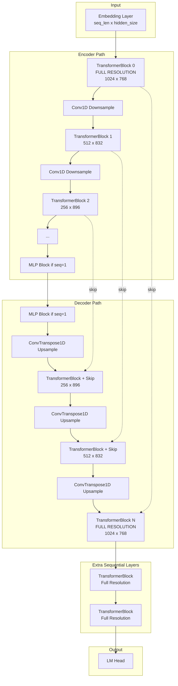

# Conv1D U-Net Transformer Implementation

## Architecture Overview




## Key Components to Implement

### 1. Config Changes ([model/model.py](model/model.py))

Add new config parameters:

```python
num_unet_layers: int = 24      # Total layers in U-Net (encoder + decoder)
num_extra_layers: int = 0      # Sequential transformer layers after U-Net  
max_length: int = 1024         # For computing when sequence becomes vector
```

Remove/deprecate `num_hidden_layers` in favor of `num_unet_layers`.

### 2. Hidden Dimension Scaling Strategy

Gradually scale from `hidden_size` to `hidden_size * 2` at bottleneck with GPU-friendly rounding:

```python
def get_hidden_sizes(hidden_size: int, num_encoder_layers: int) -> List[int]:
    """Returns hidden size for each encoder layer, rounded to multiples of 64."""
    sizes = []
    for i in range(num_encoder_layers):
        # Linear interpolation from 1.0 to 2.0
        scale = 1.0 + (i / max(num_encoder_layers - 1, 1))
        raw_size = hidden_size * scale
        # Round to nearest multiple of 64 for GPU efficiency
        rounded = int(((raw_size + 63) // 64) * 64)
        sizes.append(rounded)
    return sizes
```

### 3. Downsampling/Upsampling Modules ([model/model.py](model/model.py))

```python
class DownsampleConv(nn.Module):
    """Conv1D that halves sequence length and adjusts hidden dim."""
    def __init__(self, in_dim: int, out_dim: int):
        self.conv = nn.Conv1d(in_dim, out_dim, kernel_size=2, stride=2)

class UpsampleConv(nn.Module):
    """ConvTranspose1D that doubles sequence length and adjusts hidden dim."""  
    def __init__(self, in_dim: int, out_dim: int):
        self.conv = nn.ConvTranspose1d(in_dim, out_dim, kernel_size=2, stride=2)
```

### 4. MLP Block for Vector Depths ([model/utils.py](model/utils.py))

When sequence length = 1, replace transformer with an MLP block:

```python
class BottleneckMLP(nn.Module):
    """MLP block used when sequence is a vector (length 1)."""
    def __init__(self, hidden_size: int, expansion_ratio: float):
        self.up = Linear(hidden_size, int(hidden_size * expansion_ratio))
        self.down = Linear(int(hidden_size * expansion_ratio), hidden_size)
```

### 5. Attention Mask Handling

Strategy: Downsample document boundary information alongside the hidden states, then create block masks at each resolution. Reuse masks for encoder/decoder at matching resolutions.

```python
def downsample_docs(docs: torch.Tensor) -> torch.Tensor:
    """Downsample document IDs by taking every other position."""
    return docs[::2]

def create_resolution_masks(input_ids, num_encoder_layers, sliding_window_size):
    """Pre-compute block masks for all resolutions (reused by encoder/decoder)."""
    masks = []
    docs = (input_ids == cls_token_id).cumsum(0)
    
    for layer_idx in range(num_encoder_layers):
        seq_len = len(docs)
        mask = create_block_mask(...)  # At current resolution
        masks.append(mask)
        docs = downsample_docs(docs)  # Prepare for next layer
    
    return masks  # Used forward for encoder, reversed for decoder
```

### 6. Modified UnetTransformer Class

```python
class ConvUnetTransformer(nn.Module):
    def __init__(self, config: PLMConfig):
        self.num_encoder_layers = config.num_unet_layers // 2
        self.num_decoder_layers = config.num_unet_layers // 2
        
        # Compute which layers are at vector depth (need MLP instead)
        self.vector_depth = int(math.log2(config.max_length))
        
        # Hidden sizes for each layer
        self.hidden_sizes = get_hidden_sizes(config.hidden_size, self.num_encoder_layers)
        
        # Encoder layers (first is full res transformer, rest may be MLP)
        self.encoder_blocks = nn.ModuleList()
        self.downsamples = nn.ModuleList()
        
        # Decoder layers (last is full res transformer, rest may be MLP)  
        self.decoder_blocks = nn.ModuleList()
        self.upsamples = nn.ModuleList()
        
        # Skip connection weights
        self.skip_weights = nn.Parameter(...)
        
    def forward(self, x, attention_masks, ve, ...):
        # Encoder path
        skip_connections = []
        for i, (block, down) in enumerate(zip(self.encoder_blocks, self.downsamples)):
            x = block(x, attention_mask=attention_masks[i], ...)
            skip_connections.append(x)
            x = down(x)  # Downsample
        
        # Decoder path (reversed masks, skip connections)
        for i, (block, up) in enumerate(zip(self.decoder_blocks, self.upsamples)):
            x = up(x)  # Upsample
            x = x + self.skip_weights[i] * skip_connections.pop()
            x = block(x, attention_mask=attention_masks[-(i+1)], ...)
        
        return x
```

### 7. Extra Sequential Layers

```python
class PLM(PreTrainedModel):
    def __init__(self, config):
        ...
        self.unet_transformer = ConvUnetTransformer(config)
        
        # Extra layers after U-Net (at full resolution)
        if config.num_extra_layers > 0:
            extra_config = copy(config)
            extra_config.unet = False  # No skip connections
            self.extra_layers = nn.ModuleList([
                TransformerBlock(extra_config) 
                for _ in range(config.num_extra_layers)
            ])
```

### 8. Value Embeddings Update

Value embeddings need to match the hidden dimensions at each layer:

```python
class ValueEmbedding(nn.Module):
    def __init__(self, config: PLMConfig, hidden_sizes: List[int]):
        self.embed = nn.ModuleList([
            nn.Embedding(config.vocab_size, h) for h in hidden_sizes
        ])
```

## Files to Modify


| File                                     | Changes                                                                                                                                                                                                              |
| ---------------------------------------- | -------------------------------------------------------------------------------------------------------------------------------------------------------------------------------------------------------------------- |
| [model/model.py](model/model.py)         | Add config params, `DownsampleConv`, `UpsampleConv`, refactor `UnetTransformer` to `ConvUnetTransformer`, add extra layers logic, update `ValueEmbedding`, modify `get_last_hidden_state` for multi-resolution masks |
| [model/utils.py](model/utils.py)         | Add `BottleneckMLP` class                                                                                                                                                                                            |
| [model/attention.py](model/attention.py) | Ensure `SelfAttention` can handle variable hidden sizes (may need per-layer config)                                                                                                                                  |


## Edge Cases to Handle

1. **Odd sequence lengths**: Pad sequence to even length before downsampling if necessary
2. **Very deep networks**: When `num_unet_layers // 2 > log2(max_length)`, use MLP blocks for layers beyond vector depth
3. **Attention head count**: Ensure `hidden_size // num_attention_heads` remains valid at each resolution (may need to scale heads or keep constant)
4. **Skip connection dimension mismatch**: Use projection layers if encoder/decoder hidden dims differ at matching depths

## Testing Strategy

The existing `__main__` block in `model/model.py` can be extended to test:

- Forward pass with different `num_unet_layers` values
- Correct sequence length at each layer
- Hidden dimension changes
- MLP replacement at vector depths

