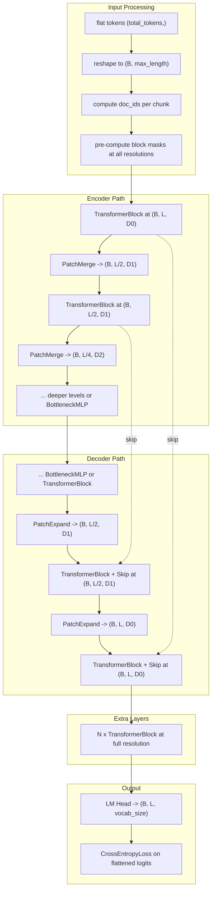

# Conv UNet Redesign + Async Data Loading + HF Hub Packaging

## Task 1: Conv UNet with Batched (B, L) Format

### Problem

The current `ConvUnetTransformer` in [model/model.py](model/model.py) concatenates all documents into `(1, total_tokens)` and uses Conv1D downsampling. This causes:

- Documents reach vector-depth at different rates due to variable lengths
- Conv1D kernels mix tokens across document boundaries
- Complex `insert_padding_for_short_docs` / `remove_padding` logic with dynamic shapes that break `torch.compile`
- Block masks must be regenerated at every resolution inside the forward pass

### Solution: Batched Format + Patch Merging

**Data reshape**: The flat `(total_tokens,)` tensor from the data loader is reshaped to `(B, max_length)` inside the model, where `B = total_tokens // max_length`. Each chunk contains packed documents. The data loader is also modified to pack into `max_length`-aligned chunks so no document spans a chunk boundary.

**Flex attention with B > 1**: Per the [PyTorch docs](https://docs.pytorch.org/docs/stable/nn.attention.flex_attention.html), `create_block_mask(mask_mod, B, H, Q_LEN, KV_LEN)` natively supports batch dimension. The `mask_mod(b, h, q_idx, kv_idx)` receives the batch index and can look up per-chunk document IDs. **Padding blocks are automatically skipped** -- when `mask_mod` returns False for an entire BLOCK_SIZE x BLOCK_SIZE tile, flex_attention never computes it. This is the "don't compute over pad tokens" mechanism.

**Patch merging (Swin-style)** instead of Conv1D for downsampling:

```python
class PatchMerge(nn.Module):
    """(B, L, D) -> (B, L//2, D_out): concatenate adjacent token pairs + linear projection"""
    def __init__(self, in_dim, out_dim):
        self.projection = Linear(2 * in_dim, out_dim)
    def forward(self, x):
        B, L, D = x.shape
        x = x.view(B, L // 2, 2 * D)
        return self.projection(x)

class PatchExpand(nn.Module):
    """(B, L//2, D_in) -> (B, L, D_out): linear projection + reshape"""
    def __init__(self, in_dim, out_dim):
        self.projection = Linear(in_dim, 2 * out_dim)
    def forward(self, x):
        B, L_half, D = x.shape
        x = self.projection(x)
        return x.view(B, L_half * 2, -1)
```

**Document boundary downsampling**: `doc_ids.view(B, L//2, 2).max(dim=-1).values` preserves boundaries at each resolution. Similarly for `last_real_token` positions.

**Pre-computed multi-resolution masks**: Before the forward pass, compute block masks at each UNet resolution (full, half, quarter, etc.) in one batch. These are passed into the transformer, not created inside it.

### Architecture




### Key Changes to Files

**[model/attention.py](model/attention.py)**:

- Update `SelfAttention.forward()` to accept `(B, L, D)` input (currently only `(L, D)`)
- Q/K/V reshape: `(B, L, n_heads, d_head)` instead of `(1, L, n_heads, d_head)`
- Rotary embeddings already broadcast over batch dim -- no change needed

**[model/model.py](model/model.py)**:

- Add `PatchMerge`, `PatchExpand` modules (replace `DownsampleConv`, `UpsampleConv`)
- New `BatchedUnetTransformer` class replacing `ConvUnetTransformer`
- New `BatchedTransformerBlock` (or update `FlexTransformerBlock` for batched dims)
- Update `PLM.forward()` and `PLM.get_last_hidden_state()`:
  - Reshape `(total_tokens,)` to `(B, max_length)` for conv_unet mode
  - Pre-compute block masks at all resolutions before forward pass
  - Compute loss on `(B*L, vocab_size)` flattened logits
- Remove old `ConvUnetTransformer`, `DownsampleConv`, `UpsampleConv`, `insert_padding_for_short_docs`, `remove_padding`, `downsample_last_eos`, `get_doc_boundaries` (dead code)
- Keep `ValueEmbedding` for old UNet, add batched value embeddings for new UNet
- Keep `UnetTransformer` and `Transformer` paths unchanged (coexist)

**[model/utils.py](model/utils.py)**: Minor -- `BottleneckMLP` updated for `(B, 1, D)` input

### Bug Fix: mask_rate with persistent workers

The current `OptimizedTrainLoader.set_mask_rate()` mutates `self._dataset.mask_rate`, but with `persistent_workers=True`, each worker forks the dataset object -- mutations in the main process are **never seen by workers**. This means mask rate scheduling is silently broken. Moving masking to GPU (Task 2) fixes this entirely.

---

## Task 2: Async Data Loading + GPU-Side Masking

### Data Loader Changes ([data/dataloading.py](data/dataloading.py))

**Chunk-aligned packing** -- new `ChunkedTrainLoader`:

- Documents packed into `max_length`-aligned chunks (no document spans a chunk boundary)
- If a document doesn't fit in the current chunk, pad the remainder and start a new chunk
- If a document exceeds `max_length`, truncate to `max_length` (its own chunk)
- Returns `(B, max_length)` int32 tensors where `B = micro_batch_tokens // max_length`
- For non-conv-unet modes, flatten to `(B * max_length,)` to preserve legacy interface

**No masking in data loader** -- raw packed tokens only:

- Remove `_apply_masking()` from `TrainLoader` and `EvalLoader`
- Data loader yields `(input_ids_raw,)` only
- Much simpler worker code, no mask_rate synchronization issue

### GPU-Side Masking ([train.py](train.py))

New `apply_masking_gpu()` function called in the training loop after H2D transfer:

```python
def apply_masking_gpu(input_ids, special_tokens, mask_rate, mlm=False):
    """Apply masking on GPU -- much faster than CPU, no worker sync issues."""
    mask_probs = torch.rand_like(input_ids, dtype=torch.float32)
    if mlm:
        mask_indices = mask_probs < mask_rate
    else:
        # Masked diffusion: random rate per batch
        rate = torch.rand(1, device=input_ids.device) * mask_rate
        mask_indices = mask_probs < rate
    # Don't mask special tokens
    special_mask = torch.isin(input_ids, special_tokens)
    mask_indices = mask_indices & ~special_mask
    labels = input_ids.clone()
    labels[~mask_indices] = -100
    noisy = torch.where(mask_indices, MASK_TOKEN_ID, input_ids)
    return noisy, labels, rate
```

### CUDA Stream Double Buffering

New `AsyncBatchPipeline` wrapper around the data loader:

- Uses a background CUDA stream for H2D transfers
- While the current batch trains on the default stream, the next batch is being transferred on the transfer stream
- `next_batch()` returns the pre-staged GPU tensor and starts transferring the next one
- Overlaps data transfer latency with compute

### Changes to [train.py](train.py)

- Replace `OptimizedTrainLoader` with `ChunkedTrainLoader` + `AsyncBatchPipeline`
- Move masking into training loop (`apply_masking_gpu`)
- Remove `set_mask_rate()` / `set_mlm()` calls (mask_rate controlled directly in training loop)
- Update eval loop similarly

---

## Task 3: HuggingFace Hub Integration

### Config Changes ([model/model.py](model/model.py))

Add `auto_map` to `PLMConfig.__init__()`:

```python
self.auto_map = {
    "AutoModel": "model--PLM",
    "AutoModelForMaskedLM": "model--PLM",
}
```

This tells HF's `AutoModel.from_pretrained(trust_remote_code=True)` which class to load.

### Inference Methods on `PLM`

- `get_last_hidden_state(input_ids, attention_mask=None)` -- already exists, clean up interface for single-sequence inference (handle both batched and single-sequence input)
- `get_logits(input_ids, attention_mask=None)` -- returns `lm_head(last_hidden_state)` without loss computation
- `get_embeddings(input_ids, attention_mask=None, pooling='mean')` -- returns per-sequence pooled embeddings `(B, D)`, supporting mean/cls pooling

### Source Code Packaging

Override `push_to_hub()` on `PLM` to also upload the source files needed for `trust_remote_code`:

- `model.py` (the main model file -- may need to consolidate imports)
- `attention.py`
- `utils.py`

Alternatively, create a single consolidated `modeling_plm.py` file that bundles all model code for cleaner HF Hub packaging. This avoids import path issues with `trust_remote_code`.

### Changes to [train.py](train.py)

- Update `save_checkpoint()` to use the new `push_to_hub()` that includes source code

---

## Additional Improvements Identified

- **Kernel options**: Pass `ROWS_GUARANTEED_SAFE=True` to flex_attention for non-padding blocks (each document token has at least one valid key) -- free perf boost
- **Compilation friendliness**: The batched format with fixed `(B, max_length)` shapes eliminates all dynamic shape issues that plague the current Conv UNet, making `torch.compile` much more effective
- **Value embedding downsampling**: At lower UNet resolutions, downsample value embeddings via average pooling of pairs (simpler than per-resolution embedding tables)

